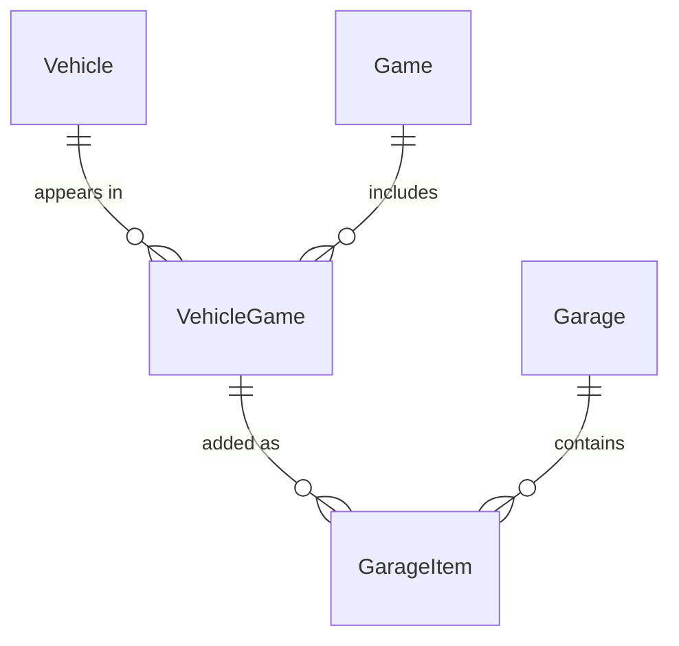

# los-santos-garage
examine and create your dream garage of all vehicles from the GTA series from the 3D era to now.

# Scope
The vehicles for this app will come from the mainline video games in the GTA series. These games being GTA3, GTA Vice City, GTA San Andreas, GTA4, and GTA5
- v1 is a single garage with no accounts
- GTA Online vehicles are not included

# MVP features
- Browse the vehicle catalog
- Add a vehicle to the garage
- when adding vehicle user selects which game to choose from
- Delete a vehicle from the garage
- See all vehicles in the garage

# Later list
- add images
- edit the color of the vehicle
- user accounts

## Data Model

### Vehicle
A vehicle as it exists across the series (e.g., Infernus).

| Field | Type   | Notes       |
|-------|--------|-------------|
| Id    | int    | Primary key |
| Name  | string | Required    |

### Game
| Field       | Type     | Notes       |
|-------------|----------|-------------|
| Id          | int      | Primary key |
| Name        | string   | Required    |
| ReleaseDate | DateOnly |             |

### VehicleGame
A specific vehicle in a specific game (e.g., Infernus in GTA IV). Holds per-game attributes.

| Field     | Type         | Notes                      |
|-----------|--------------|----------------------------|
| Id        | int          | Primary key                |
| VehicleId | int          | FK → Vehicle               |
| GameId    | int          | FK → Game                  |
| Class     | VehicleClass | Enum (Sports, Compact, Truck, ...) |

**Constraint:** Unique on (`VehicleId`, `GameId`)

### Garage
| Field | Type   | Notes       |
|-------|--------|-------------|
| Id    | int    | Primary key |
| Name  | string | Required    |

> v1 has a single garage. The table exists so user accounts can be added later without a schema redesign.

### GarageItem
One vehicle in a garage.

| Field         | Type     | Notes            |
|---------------|----------|------------------|
| Id            | int      | Primary key      |
| GarageId      | int      | FK → Garage      |
| VehicleGameId | int      | FK → VehicleGame |
| DateAdded     | DateTime | Set on insert (UTC) |